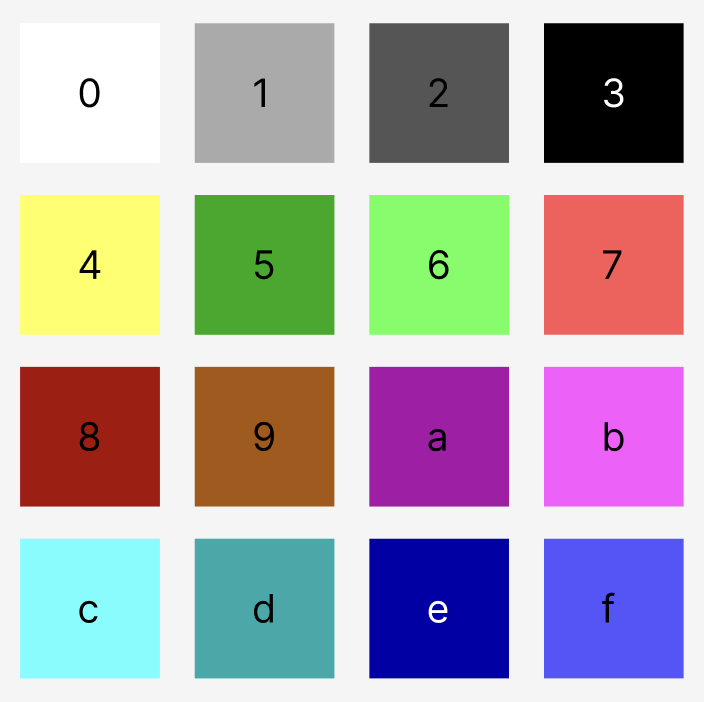
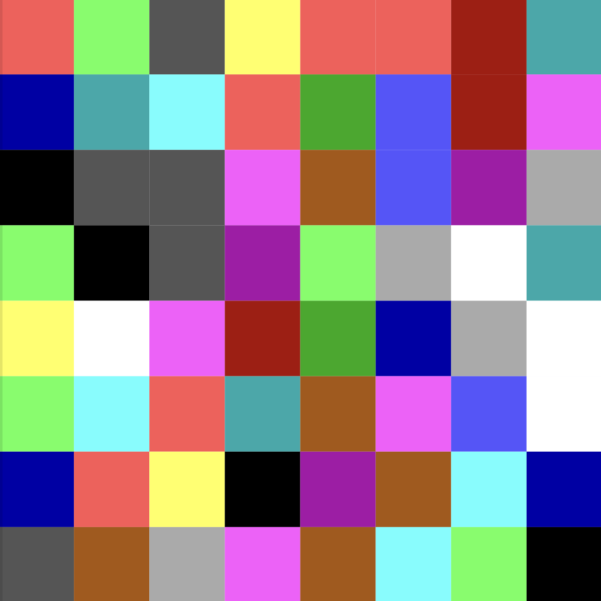
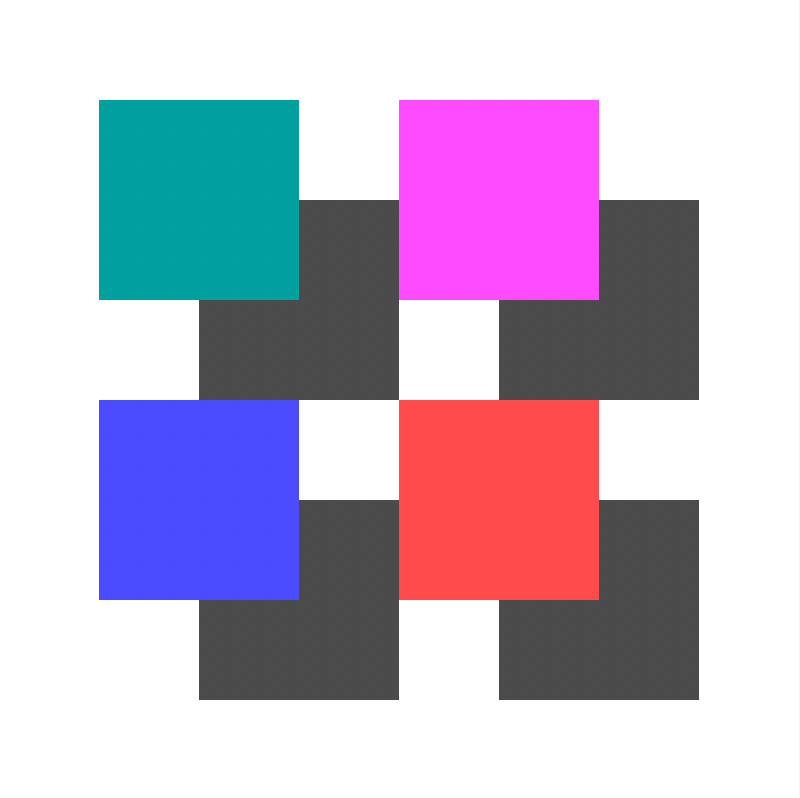

# BitPackedMap

On-chain 8x8 bitmap svg packed into a single 32 byte storage slot. By packing the bitmap into a single storage slot, we can dramatically reduce gas consumption.

## How it works

Each bitmap has 64 squares, with each square corresponding to a 4 bit color.

#### Color pallet

#### Example

Consider the following bitmap: `0x7624778dedc75f8b322b9fa1632a610d40b85e106c7d9bf0e743a9ce291b9c63`. We can see how each 4 bit value is assigned to a square according to the above color pallet.

| **7** | **6** | **2** | **4** | **7** | **7** | **8** | **d** |
| ----- | ----- | ----- | ----- | ----- | ----- | ----- | ----- |
| **e** | **d** | **c** | **7** | **5** | **f** | **8** | **b** |
| **3** | **2** | **2** | **b** | **9** | **f** | **a** | **1** |
| **6** | **2** | **3** | **a** | **6** | **1** | **0** | **d** |
| **4** | **0** | **b** | **8** | **5** | **e** | **1** | **0** |
| **6** | **c** | **7** | **d** | **9** | **b** | **f** | **0** |
| **e** | **7** | **4** | **3** | **a** | **9** | **c** | **e** |
| **2** | **9** | **1** | **b** | **9** | **c** | **6** | **3** |

And a more intentionally arranged bitmap: `0x000000000dd0bb000dd2bb20002202200ff077000ff277200022022000000000`

## Variations

For the initial implementation we went with an 8x8 grid of 4 bit colors, but we can do this with different grid sizes and color profiles as long as they are inversely related. For example, we can do the following variations:

- 4x4 grid of 8 bit colors (256 different colors)
- 8x8 grid of 4 bit colors (16 different colors)
- 16x16 grid of 2 bit colors (4 different colors)
- 32x32 grid of 1 bit colors (2 different colors)

We can also play around with various color pallets, use an additional slot, etc..

Wanna implement a different variation? Submit a PR!
